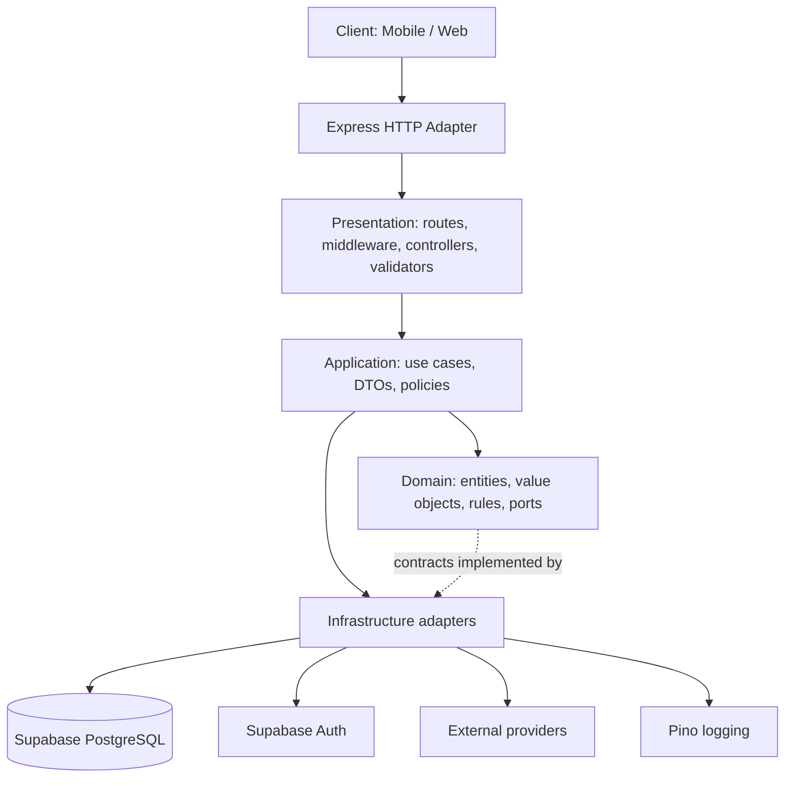
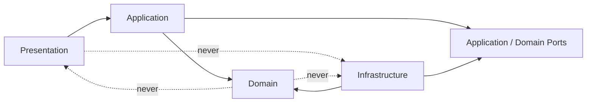
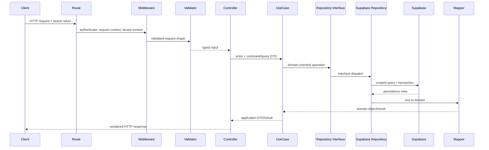

# Gym SaaS Backend Architecture

**Status:** Normative engineering specification  
**Scope:** Express API and backend services  
**Audience:** Human developers and AI coding assistants  
**Applies to:** All production backend code, migrations, integrations, and feature modules

This document is the architectural source of truth for the Gym SaaS Backend. If an implementation conflicts with this document, the implementation MUST be changed or an explicit architecture decision MUST supersede the relevant rule. Product behavior is defined by the PRD; this document defines how that behavior is implemented.

The backend is a modular monolith. It MUST remain deployable as one service while preserving boundaries that permit selected modules to become independent services later. The initial system uses Node.js 22 LTS, Express, strict TypeScript, Supabase PostgreSQL, Supabase Auth, `@supabase/supabase-js`, Zod, Pino, Vitest, Supertest, Docker, GitHub Actions, and pnpm.

## 1. Purpose

This document defines the structural, dependency, data-access, and runtime rules for the Gym SaaS Backend. It specifies where responsibilities live, how requests cross boundaries, how features are organized, and which dependencies are permitted.

The goals are to:

- keep business rules independent of Express and Supabase;
- make use cases executable without an HTTP server or database;
- isolate persistence and external providers behind interfaces;
- provide explicit tenancy and authorization boundaries for Gym-owned data (`gym_org_id`) and Client-owned data (User ownership + DataGrants);
- make feature work predictable for developers and AI agents;
- support incremental growth without prematurely introducing distributed-system complexity.

This document covers backend architecture only. Detailed API contracts, database schemas, coding conventions, CI policy, testing policy, and security standards belong in their respective documents. Where no separate document exists, the enforceable rules here apply.

## 2. Architectural Principles

These principles overlap with, but are not limited to, SOLID: **S**ingle Responsibility → §2.3; **O**pen/Closed → §2.11; **L**iskov Substitution → §2.5; **I**nterface Segregation → §2.12; **D**ependency Inversion → §2.2 (Dependency Rule). The remaining principles (Separation of Concerns, Explicit Dependencies, Fail Fast, Security by Design, Testability, Scalability, Simplicity) address system-level concerns SOLID does not cover.

### 2.1 Separation of Concerns

**Description:** Each module MUST have one primary reason to change. HTTP transport, application orchestration, domain rules, persistence, configuration, and external providers MUST be separate concerns.

**Why it exists:** Separation limits blast radius and allows a business rule to evolve without coupling it to a framework or vendor.

**Enforcement rules:**

- Controllers MUST translate HTTP input/output only.
- Use cases MUST orchestrate application behavior.
- Entities and value objects MUST enforce domain invariants.
- Repositories MUST own persistence details.
- Mappers MUST translate between persistence, domain, and API representations.
- Provider SDK calls MUST be isolated behind infrastructure adapters.

**Common violations:** SQL or Supabase queries in controllers; role checks duplicated across routes; domain entities importing Express request types; use cases returning `res.json()`; repositories containing notification or HTTP behavior.

### 2.2 Dependency Rule

**Description:** Dependencies MUST point inward toward stable policy. Domain code MUST NOT depend on application, presentation, or infrastructure code.

**Why it exists:** The core business model must survive changes to Express, Supabase, providers, and delivery mechanisms.

**Enforcement rules:**

- Domain imports MAY reference only domain and approved language/runtime primitives.
- Application MAY depend on domain contracts and shared kernel code, but MUST NOT import Express or Supabase.
- Infrastructure MAY implement application/domain interfaces.
- Presentation MAY depend on application contracts and shared transport utilities.
- Dependency direction MUST be established in the composition root, not by service locators.

**Common violations:** importing `SupabaseClient` into a use case; importing a concrete repository into domain code; allowing a domain entity to call an SDK; importing a controller from an entity.

### 2.3 Single Responsibility

**Description:** A component MUST have one cohesive responsibility and one primary axis of change.

**Why it exists:** Small units are easier to reason about, replace, and test.

**Enforcement rules:**

- A use case SHOULD represent one business command or query.
- A controller action MUST delegate business decisions.
- A repository MUST NOT become a general-purpose business service.
- A mapper MUST NOT validate permissions or mutate state.
- Middleware MUST perform cross-cutting request concerns, not feature workflows.

**Common violations:** “god” services coordinating all modules; controllers that calculate subscription dates; repositories that send push notifications; validators that query authorization state.

### 2.4 Explicit Dependencies

**Description:** Required collaborators MUST be visible in constructors or factory arguments.

**Why it exists:** Explicit dependencies make runtime composition and unit isolation deterministic.

**Enforcement rules:**

- Classes MUST use constructor injection for required collaborators.
- Global mutable clients MUST NOT be accessed directly by application or domain code.
- Optional behavior MUST be represented explicitly, not discovered through runtime reflection.
- The composition root MUST register concrete implementations.

**Common violations:** `new PrismaLikeRepository()` inside a use case; importing a singleton repository; hidden environment reads inside business logic; service-locator lookups.

### 2.5 Composition over Inheritance (includes Liskov Substitution)

**Description:** Behavior SHOULD be assembled from focused collaborators and policies rather than deep class hierarchies. Where inheritance is used at all, a subclass MUST be fully substitutable for its base type (Liskov Substitution): callers relying on the base type's contract MUST see no broken invariants, narrowed inputs, weakened guarantees, or unexpected exceptions when a subclass is used instead.

**Why it exists:** Composition reduces coupling and makes feature variations explicit. Liskov violations are a common source of subtle bugs when a "specialized" subclass secretly can't honor the contract callers were written against.

**Enforcement rules:**

- Inheritance MUST be limited to genuine substitutable abstractions — i.e. any subclass MUST satisfy the full behavioral contract of its base type, not just its method signatures.
- A subclass/implementation MUST NOT throw for inputs the base type/interface accepts, narrow accepted inputs, weaken postconditions, or silently no-op an operation the base contract guarantees.
- Cross-cutting behavior SHOULD use middleware, decorators, or injected policies.
- Domain variation SHOULD use value objects and policy interfaces.

**Common violations:** base controllers with hidden behavior; inheritance trees for every role; subclasses that override invariant-preserving methods; a repository implementation that throws `NotSupported` for a method its interface promises; a decorator that silently swallows an operation the wrapped type guarantees.

### 2.6 Fail Fast

**Description:** Invalid configuration, malformed input, and impossible state transitions MUST be rejected at the earliest boundary that can detect them.

**Why it exists:** Early failure prevents corrupted state and ambiguous downstream errors.

**Enforcement rules:**

- Configuration MUST be parsed at startup with a schema.
- HTTP input MUST be validated before a use case executes.
- Domain constructors/factories MUST reject invalid invariants.
- Repository results MUST be checked for missing or inconsistent records.
- Unknown error conditions MUST not be silently converted to success.

**Common violations:** accepting arbitrary request bodies; discovering missing environment variables on the first request; returning `null` for a required entity; swallowing provider errors.

### 2.7 Security by Design

**Description:** Authorization, tenant isolation, least privilege, and sensitive-data handling MUST be part of the flow design.

**Why it exists:** Gym data includes health, medical, nutrition, attendance, and membership information. Personal fitness data is Client-owned; gym ops data is Gym-owned (see `CONTEXT.md`, ADR-0002).

**Enforcement rules:**

- Every Gym-owned command/query MUST establish the authenticated actor and target `gym_org_id`.
- Every staff read of Client-owned data (profile attributes, progress, calories, wearables, plan adherence) MUST establish affiliation to the gym **and** a matching live DataGrant / ProfileAttributeGrant for that `(client, gym)`. Absence of a grant MUST be treated as deny.
- Client-owned rows MUST NOT be copied into a gym. Staff access is grant-to-read over the Client's rows.
- Authorization MUST be enforced in application policy/use-case boundaries and backed by database controls where applicable.
- Service-role Supabase credentials MUST remain infrastructure-only and MUST NOT be exposed to clients.
- Sensitive data MUST NOT be logged.
- Offboarding (`INACTIVE`) MUST clear DataGrants for that `(client, gym)`. DPDP erasure is a separate privileged procedure (ADR-0003), not soft-delete.

**Common violations:** accepting `gym_org_id` from the client without deriving or checking membership; trusting role claims without server-side policy; returning Client-owned progress/calories/wearables/plan completions to staff without a grant check; logging OTPs or medical notes; using an unrestricted client in presentation code.

### 2.8 Testability

**Description:** Business behavior MUST be runnable with in-memory or fake interfaces and without Express, Supabase, network access, or wall-clock dependence where avoidable.

**Why it exists:** Deterministic tests expose business regressions quickly and reduce integration-test cost.

**Enforcement rules:**

- Use cases MUST depend on interfaces.
- Time, identifiers, and external providers SHOULD be injectable when business behavior depends on them.
- Domain tests MUST not require infrastructure.
- HTTP tests MAY use Supertest, but MUST not be the only coverage for business rules.

**Common violations:** use cases constructing SDK clients; domain code reading `Date.now()` everywhere; tests requiring a live Supabase project for simple state transitions.

### 2.9 Scalability

**Description:** The system MUST scale by adding instances and isolating expensive or asynchronous work, without making every request distributed.

**Why it exists:** Check-in and plan viewing require reliable low-latency paths, while reminders, sync, and notifications can grow independently.

**Enforcement rules:**

- API instances MUST be stateless.
- Pagination MUST be enforced for collection endpoints.
- Long-running or retryable work MUST move to jobs/queues.
- Tenant and frequently queried fields MUST be indexed in migrations.
- Modules MUST communicate through contracts rather than shared persistence assumptions.

**Common violations:** in-memory session state; unbounded list queries; synchronous notification fan-out in a check-in request; cross-module writes that bypass use cases.

### 2.10 Simplicity

**Description:** The architecture MUST use the least complex mechanism that satisfies current requirements.

**Why it exists:** Complexity is a production risk and the product is initially a modular monolith.

**Enforcement rules:**

- A module MUST NOT be extracted into a service without an operational or scaling reason.
- Domain abstractions MUST represent real variation or a stable boundary.
- Infrastructure adapters MUST not introduce a second abstraction layer without need.
- New cross-module contracts MUST be documented at the boundary.

**Common violations:** event buses for synchronous CRUD; generic repositories that erase domain meaning; microservices before independent scaling is required; speculative plugin frameworks.

### 2.11 Open/Closed

**Description:** Business behavior MUST be extensible by adding new code (new adapters, new policies, new value-object variants) rather than by editing the internals of existing, already-tested use cases, entities, or adapters.

**Why it exists:** A gym-management product accretes variation over time — new payment/renewal rules, new coaching-plan shapes, new wearable providers, new lead-pipeline stages, new notification channels. Extension-by-modification of stable code repeatedly reintroduces regressions into behavior that was already correct.

**Enforcement rules:**

- New external providers (wearables, notification channels, future payment gateways) MUST be added as a new adapter implementing an existing port, without changing the use case that consumes the port.
- New variation in domain behavior (e.g. a new plan type, a new lead status) SHOULD be expressed through a new value object, policy, or strategy implementation, not a growing conditional inside an existing entity or use case.
- Adding a feature MUST NOT require editing unrelated features' internals; cross-feature extension points MUST be explicit contracts (public use cases, ports, documented events).
- A change driven purely by "add one more case" SHOULD be reviewed for whether the existing abstraction has stopped representing real variation (see §2.10) and needs a policy/strategy seam instead.

**Common violations:** a `switch` on provider name growing inside a single notification use case instead of one adapter per provider; a new membership status branching deep inside unrelated repository methods; modifying `RecordAttendanceUseCase` internals to special-case a new attendance source instead of extending via a port.

### 2.12 Interface Segregation

**Description:** A consumer MUST depend only on the operations it actually calls. Interfaces MUST be shaped around the needs of their narrowest consumer, not around the full capability of the underlying aggregate or provider.

**Why it exists:** Fat interfaces force unrelated consumers (e.g. a command use case and a reporting screen) to share a contract that changes for either one's reasons, and force unit tests to fake capabilities the code under test never uses (§2.8).

**Enforcement rules:**

- Repository interfaces MUST be segregated into command repositories and query interfaces per §10; a use case MUST depend on only the one it needs.
- Provider ports (notifications, wearables, storage) MUST expose only the operations a consuming use case requires, not the provider SDK's full surface.
- Widening an interface to satisfy one new caller MUST NOT be done if it forces existing callers to depend on methods they will never invoke; prefer a second, narrower interface.
- Shared "utility" interfaces MUST NOT accumulate unrelated methods over time; if a fake/mock implementation only supports part of an interface, that interface is a segregation candidate.

**Common violations:** a single `MembershipRepository` exposing both `save()` and `listExpiringSoon()`; a `NotificationProvider` port exposing every method a vendor SDK has instead of just `send()`; a test fake that throws `not implemented` for half an interface's methods.

## 3. High-Level Architecture

The backend exposes a REST API to the mobile and web clients. Express is an adapter at the edge; it is not the application architecture.




**Client** sends authenticated HTTP requests and MUST NOT receive persistence models directly.  
**Express** owns HTTP server behavior, routing, middleware execution, and response termination.  
**Presentation** translates transport concerns into application inputs and application results into HTTP responses.  
**Application** coordinates use cases, authorization policies, transactions, and ports.  
**Domain** contains business concepts and invariants that are independent of delivery and persistence.  
**Infrastructure** implements ports using Supabase, Auth, logging, configuration, queues, storage, and third-party providers.  
**Supabase** provides PostgreSQL, Auth, and selected platform services; it MUST be reached only through infrastructure adapters.

## 4. Clean Architecture

### 4.1 Presentation

**Responsibilities:** route registration, request context creation, authentication middleware integration, input validation, controller invocation, error-to-HTTP translation, and response serialization.

**Allowed dependencies:** application input/output contracts, shared error types, shared transport helpers, and Express adapter types.

**Forbidden responsibilities:** business rules, database queries, Supabase SDK calls, transaction management, domain calculations, provider orchestration, and direct authorization decisions that belong to application policy.

Controllers MUST be thin: parse already-validated input, obtain actor/request context, invoke exactly the appropriate use case, and map the result to an HTTP response.

### 4.2 Application

**Responsibilities:** use cases, application services, command/query orchestration, authorization policy invocation, transaction boundary selection, DTO definitions, and coordination of repositories and external ports.

**Use Cases:** each meaningful business operation MUST have an explicit use case, such as `ClaimMembership`, `RecordAttendance`, `AssignWorkoutPlan`, `ListRenewals`, or `ConvertLead`.

**Services:** application services MAY coordinate multiple use cases or reusable workflows. They MUST not become an unbounded “business logic” bucket.

**DTOs:** application inputs and outputs MUST be explicit and stable at the application boundary. API DTOs MAY be mapped from application DTOs where transport concerns differ.

**Allowed dependencies:** domain entities/value objects, repository interfaces, clock/id/transaction ports, notification/storage/provider ports, and shared primitives.

**Forbidden responsibilities:** Express response handling, Supabase queries, SDK-specific types, raw database row manipulation, and HTTP-specific validation.

### 4.3 Domain

**Entities:** identity-bearing objects such as `User`, `GymOrg`, `GymAdmin`, `TrainerProfile`, `ClientMembership`, `Subscription`, `Attendance`, `Lead`, `DietPlan`, and `WorkoutPlan`.

**Value Objects:** invariant-bearing concepts such as `GymOrgId`, `UserId`, `PaymentStatus`, `MembershipStatus`, `Role`, `EmailAddress`, `DateRange`, and `Money`.

**Entity vs. Value Object:**

| | Entity | Value Object |
|---|---|---|
| Identity | Has identity (an id that persists across changes) | No identity — two instances with the same value are interchangeable |
| Mutability | MAY change state over its lifecycle | MUST be immutable; a change produces a new instance |
| Equality | By identity (same id = same entity, even if fields differ) | By value (same fields = equal, regardless of instance) |
| Examples in this system | `ClientMembership`, `Subscription`, `User`, `GymOrg` | `MembershipStatus`, `Money`, `EmailAddress`, `DateRange` |

A constructor/factory for a Value Object MUST reject invalid states at creation time (§2.6); a Value Object MUST NOT expose mutator methods that leave it, even transiently, in an invalid state.

**Repository Interfaces:** domain/application ports express meaningful operations, not vendor-shaped CRUD. For example, `MembershipRepository.findActiveByClient()` is preferred over `find({ where: ... })`.

**Business Rules:** the domain MUST enforce state transitions and calculations including membership status, check-in blocking, subscription start rules, payment-status semantics, and role/capability invariants.

**Forbidden dependencies:** Express, Supabase, `@supabase/supabase-js`, Pino, environment variables, HTTP status codes, SQL types, and external provider SDKs.

### 4.4 Infrastructure

**Responsibilities:** repository implementations, Supabase client construction, persistence mappers, transaction adapters, Auth integration, logging, configuration loading, queue/job adapters, file storage, and third-party integrations.

**Repositories:** infrastructure repositories translate domain operations into Supabase queries and map rows back to domain objects.

**Supabase:** all Supabase client creation and calls MUST live in infrastructure. A Supabase type MUST NOT cross into domain or application contracts.

**Logging:** Pino adapters MUST provide structured logs and correlation/request identifiers. Sensitive payloads MUST be redacted.

**Configuration:** environment variables MUST be parsed once at startup and exposed through a typed configuration object.

**External Services:** each provider MUST be wrapped by an interface and adapter, so provider replacement does not change use cases.

**Forbidden responsibilities:** defining core business rules, accepting HTTP requests, deciding API response shapes, or bypassing application authorization.

## 5. Dependency Rule

Dependencies point toward policy:




### Allowed dependencies

- Presentation MAY import application contracts and transport utilities.
- Application MAY import domain and port interfaces.
- Infrastructure MAY import application/domain interfaces and concrete SDKs.
- Composition root MAY import every layer to assemble the system.
- Shared code MAY be imported inward only when it contains framework-neutral primitives.

### Forbidden dependencies

- Domain MUST NOT import any outer layer.
- Application MUST NOT import Express, Supabase, or provider SDKs.
- Presentation MUST NOT import concrete repositories or Supabase clients.
- Features MUST NOT reach into another feature’s infrastructure implementation.
- A repository MUST NOT call another repository’s private persistence details; cross-feature behavior belongs in a use case or explicit application service.

An import graph check, lint rule, or review MUST reject these violations. Examples include `RecordAttendanceUseCase` importing `createClient`, `ClientMembership` importing `Request`, and `AttendanceController` calling `.from('attendance')`.

## 6. Folder Structure

```text
src/
├── app/
│   ├── composition-root.ts
│   ├── http-server.ts
│   └── routes.ts
├── features/
│   ├── auth/
│   ├── gym-orgs/
│   ├── users/
│   ├── memberships/
│   ├── attendance/
│   ├── coaching/
│   ├── nutrition/
│   ├── leads/
│   ├── notifications/
│   └── health-sync/
├── domain/
│   ├── shared/
│   └── errors/
├── infrastructure/
│   ├── supabase/
│   ├── repositories/
│   ├── auth/
│   ├── providers/
│   ├── jobs/
│   ├── logging/
│   └── storage/
├── presentation/
│   ├── http/
│   │   ├── middleware/
│   │   ├── errors/
│   │   └── serializers/
│   └── validation/
├── shared/
│   ├── result/
│   ├── pagination/
│   └── primitives/
└── config/
    ├── environment.ts
    └── constants.ts
```

`app/` is the composition root and runtime assembly. `features/` owns vertical business slices and MUST contain feature-specific application and presentation code. `domain/` contains shared domain primitives and errors only. A value object or entity type MAY move to `domain/shared` only when two or more *unrelated* features need to import that type itself; a feature that merely needs to reference another feature's aggregate MUST hold a primitive id (e.g. a branded string/number type), not import the owning feature's domain type. Anything not meeting that bar stays in its owning feature's `domain/`, even if the underlying data (e.g. a `gym_org_id` column) appears on many tables. The same test applies to `domain/errors`: generic infrastructure error types used across every feature (`NotFound`, `Conflict`, `UniqueViolation`, `TransientDatabaseFailure`, `DatabaseUnavailable` — see §10) belong there because every feature's application layer must catch them; feature-specific domain/application errors (e.g. `MembershipNotActive`, `AlreadyClaimed` — see §13) do not, and stay in their owning feature. `infrastructure/` owns all vendor and persistence implementations. `presentation/` owns framework adapters shared across features. `shared/` is for framework-neutral, non-domain utilities with no feature policy (e.g. generic pagination/result wrappers) — domain-flavored primitives do not belong here even if broadly used. `config/` owns startup configuration and static operational constants.

The directory layout is a boundary, not a filing preference. New files MUST be placed according to ownership.

## 7. Feature Module Structure

Each feature MUST be independently understandable and MUST expose only its public application/presentation surface.

```text
features/workouts/
├── domain/
│   ├── workout-plan.ts
│   ├── workout-session.ts
│   ├── workout-plan.repository.ts
│   └── workout-plan.queries.ts
├── application/
│   ├── create-workout-plan.use-case.ts
│   ├── assign-workout-plan.use-case.ts
│   ├── list-client-workouts.use-case.ts
│   └── workout.dto.ts
├── presentation/
│   ├── workout.controller.ts
│   ├── workout.routes.ts
│   └── workout.schemas.ts
├── infrastructure/
│   ├── supabase-workout-plan.repository.ts
│   └── workout.mapper.ts
├── composition.ts
└── tests/
    ├── domain/
    ├── application/
    ├── infrastructure/
    └── presentation/
```

`composition.ts` is the feature's own composition unit: it constructs the feature's repositories and use cases from shared infrastructure passed in by the composition root, and exposes them for `composition-root.ts` and `routes.ts` to consume. It MUST NOT be imported by the feature's own domain, application, or presentation code — only by the composition root.

The same pattern applies to `auth`, `users`, `workouts`, and `nutrition`, as well as attendance, memberships, leads, notifications, and health sync. A feature MAY use a subdirectory under shared infrastructure for its adapter, but the feature’s repository interface MUST remain inward-facing.

Features MUST align with business capabilities, not database tables. `gym-orgs` owns the tenancy root (`GymOrg`) — organization lifecycle, branding, ownership, membership/staff invite issuance, and per-org staff affiliation (`GymAdmin`, `TrainerProfile`); Gym-owned features reference a `gym_org_id` (and, where relevant, a `TrainerProfile` id) but do not own `GymOrg` itself. Client-owned personal data (profile, progress, calories, wearables/metrics) is keyed by the User, not by `gym_org_id`; staff reach it only through DataGrants. Assigned diet/workout plan instances are Client-owned with assigning-gym/trainer provenance. `nutrition` owns the `FoodItem` catalog, servings, CustomFood, and the calorie diary; completing a diet item is a coaching use case that calls a nutrition command port (ADR-0006). `coaching` owns the `ExerciseItem` catalog (seed + later CustomExercise) and diet/workout plan instances (ADR-0007). `ExerciseItemId` stays in the coaching feature domain until a second unrelated feature persists it. `memberships` owns membership lifecycle, tenant relationship rules, and grant clearing on offboard; `billing` is not a separate payment gateway in MVP because payment status is part of subscription behavior. `coaching` MAY contain diet and workout submodules where their rules diverge. Cross-feature workflows MUST be orchestrated in application code through public use-case contracts. `FoodItemId`, `FoodServingId`, and `MealSlot` live in `src/domain/shared` because both `nutrition` and `coaching` persist them.

## 8. Request Lifecycle

Command and query requests take different paths through the same layers (§10, [ADR-0001](./adr/0001-logical-cqrs-for-repository-interfaces.md)):

**Write (command):**

```text
HTTP Request
→ Middleware (auth, tenant context)
→ Validator (Zod)
→ Controller
→ Command (application input DTO)
→ Use Case
→ Value Object / Entity (invariants)
→ Policy (authorization / cross-record rules)
→ Command Repository (Port)
→ Repository Implementation
→ Supabase
```

**Read (query):**

```text
HTTP Request
→ Middleware (auth, tenant context)
→ Validator (Zod)
→ Controller
→ Query (application input DTO)
→ Use Case
→ Query Interface (Port)
→ Query Implementation
→ Supabase
→ Read-model DTO (e.g. MembershipSummary)
→ Serializer
```

The query path deliberately does not reconstruct a domain Entity — a query interface returns read-model DTOs shaped for the screen/report requesting them (§10), because reads carry no invariants to protect. The full sequence for a single request follows:




1. **HTTP request:** the client sends a request. The server MUST assign a correlation identifier.
2. **Route:** the route selects the feature endpoint and MUST not contain business logic.
3. **Middleware:** authentication, request context, rate limits, and cross-cutting concerns run here. Tenant context MUST be derived from authenticated membership and route semantics, not blindly trusted from a body field.
4. **Validation:** Zod schemas validate syntax, types, limits, and transport shape. Validation MUST complete before use-case execution.
5. **Controller:** the controller constructs an application command/query and delegates.
6. **Use case:** the use case authorizes the action, applies business rules, coordinates ports, and returns an application result.
7. **Repository interface:** the use case calls a domain-oriented port.
8. **Repository implementation:** infrastructure translates the operation to Supabase, applies tenant predicates, and maps errors.
9. **Supabase:** the database executes the scoped query or transaction.
10. **Mapper:** persistence rows become domain objects; domain objects become output DTOs through an explicit mapper/serializer.
11. **HTTP response:** the controller returns the approved status and representation. No persistence row is returned directly.

## 9. Layer Responsibilities


| Component                  | Responsibilities                                                             | Must Do                                                                    | Must Never Do                                                                              |
| -------------------------- | ---------------------------------------------------------------------------- | -------------------------------------------------------------------------- | ------------------------------------------------------------------------------------------ |
| Controllers                | HTTP translation                                                             | Accept validated input, call one use-case boundary, serialize result       | Query Supabase, calculate business rules, manage transactions                              |
| Middleware                 | Cross-cutting request processing                                             | Authenticate, attach context, enforce generic request policies             | Execute feature workflows or mutate domain state                                           |
| Validators                 | Transport input validation                                                   | Parse and reject malformed input with typed errors                         | Perform authorization or persistence queries                                               |
| Use Cases                  | Application orchestration                                                    | Authorize, enforce workflow rules, call ports, return DTO/result           | Import Express/Supabase or shape raw HTTP responses                                        |
| Services                   | Reusable application/domain coordination                                     | Encapsulate cohesive policies or workflows                                 | Become an unbounded catch-all                                                              |
| Entities                   | Identity and lifecycle rules                                                 | Protect invariants and valid state transitions                             | Read configuration, call SDKs, know HTTP                                                   |
| Value Objects              | Validated concepts                                                           | Make invalid values unrepresentable                                        | Perform I/O or contain transport concerns                                                  |
| Repository Interfaces      | Persistence ports, segregated into command repositories and query interfaces | Define meaningful domain-oriented operations, scoped to one consumer shape | Mention Supabase, SQL, rows, or SDK types; mix command and query concerns in one interface |
| Repository Implementations | Persistence adapters                                                         | Scope queries, map rows, translate provider errors                         | Define business workflows or return HTTP errors                                            |
| Mappers                    | Representation translation                                                   | Convert persistence/domain/API shapes explicitly                           | Authorize, persist, or silently discard required fields                                    |
| DTOs                       | Stable boundary data                                                         | Define use-case/API input and output contracts                             | Act as mutable domain entities or expose database rows                                     |


## 10. Repository Pattern

Repository interfaces MUST be defined inward, close to the domain/application that consumes them, and MUST be segregated by consumer shape (logical CQRS — see [ADR-0001](./adr/0001-logical-cqrs-for-repository-interfaces.md)): a narrow **command repository** for invariant-preserving lookups and writes, and a separate **query interface** for listing, filtering, and reporting. A command use case MUST depend only on the command repository; a read/reporting use case MUST depend only on the query interface. Both are implemented against the same Supabase tables in the same transaction — there is no separate read store and no eventual consistency.

```ts
interface MembershipRepository {
  findById(id: MembershipId): Promise<ClientMembership | null>;
  findActiveByClient(clientId: UserId): Promise<ClientMembership | null>;
  save(membership: ClientMembership): Promise<void>;
}

interface MembershipQueries {
  listExpiringSoon(criteria: ExpiringSoonCriteria, page: Pagination): Promise<Page<MembershipSummary>>;
  listRoster(criteria: RosterCriteria, page: Pagination): Promise<Page<MembershipSummary>>;
}
```

The concrete Supabase repository/query implementation owns table names, column names, query builders, pagination syntax, row conversion, and provider error translation. Supabase MUST NEVER be used outside repository/query implementations and other explicitly designated infrastructure adapters.

### Mapping

Persistence rows MUST be mapped to domain entities before application logic uses them. Domain entities MUST be mapped to persistence records before writes. API DTOs MUST be separately mapped so schema changes do not expose database structure.

### Pagination and filtering

Collection queries MUST use explicit pagination. Cursor pagination SHOULD be used for mutable or large feeds; offset pagination MAY be used for stable administrative tables with bounded limits. Every list operation MUST define a maximum page size. Filters MUST be represented by typed criteria objects and MUST be allowlisted; arbitrary column names or raw query fragments MUST NOT enter a repository.

Gym-owned repositories MUST require tenant context or a tenant-scoped identifier as an explicit argument and MUST apply `gym_org_id` predicates (membership, attendance, subscriptions, leads, notifications, assigning-gym provenance on plan instances). Client-owned repositories MUST key by `client_user_id` (or the owning User id) and MUST NOT invent a `gym_org_id` owner column. Staff-facing queries over Client-owned data MUST be gated by a grant check in the use case/policy (and preferably in SQL/RLS) for the actor's gym.

### Transactions

A use case that changes multiple records atomically MUST execute through a transaction port. The transaction abstraction MUST be vendor-neutral. The Supabase implementation MAY use PostgreSQL transactions through an approved server-side mechanism; a sequence of unrelated client calls MUST NOT be described as a transaction. Transaction boundaries belong to application workflows, while transaction mechanics belong to infrastructure.

### Error handling

Repositories MUST translate Supabase/PostgreSQL errors into typed infrastructure errors such as `NotFound`, `Conflict`, `UniqueViolation`, `TransientDatabaseFailure`, or `DatabaseUnavailable`. They MUST preserve correlation context without leaking SQL, tokens, or provider internals to clients.

## 11. Dependency Injection

The **composition root** is `src/app/composition-root.ts`. It MUST be the only normal *entry point* for assembling the system, but it MUST NOT itself contain per-feature wiring. Each feature MUST export its own composition unit (e.g. `features/<name>/composition.ts` exposing a `register(...)`/`compose...(...)` function) that constructs that feature's concrete repositories, use cases, and feature-specific providers from shared infrastructure handed to it (Supabase client, clock, id generator, logger, configuration). `composition-root.ts` MUST only call each feature's composition unit and wire cross-feature dependencies explicitly; it MUST NOT construct feature-internal collaborators directly. This keeps each feature independently understandable (§7) and gives the composition root one reason to change — the set of features and their cross-feature contracts — rather than one reason per feature.

Dependency registration MUST:

- construct one configured Supabase client per intended process lifetime;
- register stateless repositories as process-lifetime dependencies unless a transaction-scoped instance is required;
- create request-scoped context values per request;
- inject interfaces into use cases and services;
- pass configuration as a typed object rather than reading `process.env` in business code.

Constructor injection is mandatory for required dependencies. A use case MAY receive repositories, transaction managers, clocks, ID generators, notification ports, and authorization policies. It MUST NOT receive `Express.Request`, `Express.Response`, a raw Supabase client, or a generic service locator. Controllers MAY receive a use case and response serializer; they SHOULD NOT receive repositories.

## 12. Database Access Strategy

Supabase PostgreSQL is the system of record for application data. Supabase Auth is the identity provider. The backend MUST use a server-side Supabase client configured in infrastructure, and credentials MUST be selected according to the operation’s trust boundary.

Repositories own table access and MUST enforce ownership predicates: `gym_org_id` for Gym-owned aggregates; User ownership for Client-owned aggregates; DataGrant / ProfileAttributeGrant for staff reads of Client-owned data. Row Level Security (RLS) SHOULD provide defense in depth for direct Supabase access and service-role mistakes, but RLS MUST NOT replace application authorization. Any service-role path MUST be narrowly wrapped and MUST perform explicit actor/tenant (and grant, when applicable) checks before mutation.

Schema changes MUST be represented by reviewed, forward-applied SQL migrations. Migrations MUST add required indexes for tenant keys, foreign keys, status/date queries, grant lookups, and pagination access paths. Destructive changes MUST have a compatibility and rollout plan. The database MUST use constraints for uniqueness, foreign keys, and invariant portions that are safely enforceable at persistence level — including subscription non-overlap (exclusion constraint) and price/duration snapshots on billing lines (ADR-0004), catalog-only diet/diary lines with serving-matches-food (ADR-0006), and catalog-only workout lines (`exercise_item_id`, ADR-0007). Partial uniques over soft-deletable tables MUST use `WHERE deleted_at IS NULL`.

Audit records MUST be written for payment-status changes, plan assignments, Admin-recorded attendance, check-in blocks, membership status changes, grant grant/revoke, and other actions designated sensitive by the product. Audit entries MUST record actor, tenant (when applicable), action, target, timestamp, and relevant non-sensitive change metadata.

Soft deletes are the default for mutable business entities via `deleted_at timestamptz NULL` (null = live; see `docs/schema.dbml`, ADR-0005). Repositories MUST exclude `deleted_at IS NOT NULL` by default and MUST expose explicit administrative recovery queries. Lifecycle statuses (`ACTIVE` / `INACTIVE`, invite `PENDING` / `ACCEPTED` / …, coaching `ACTIVE` / `ARCHIVED`) remain for domain state; they do not replace soft delete. Append-only `audit_logs` and frozen `roles` / `role_permissions` MUST NOT use soft delete.

DPDP erasure is a separate privileged path (ADR-0003): hard-delete or irreversible anonymize of Client-owned records and DataGrants; anonymize-retain Gym-owned ops/billing/attendance as required; scrub audit subject/actor to a tombstone; then delete the auth/`users` row. Normal application code MUST NOT hard-delete mutable business entities outside that procedure.

Data access MUST preserve future portability. Domain and application contracts MUST not contain Supabase query-builder types, PostgreSQL JSON shapes, or Auth-specific session objects. Portability does not require supporting a second database today; it requires keeping vendor assumptions at the infrastructure boundary.

## 13. Error Propagation

Errors MUST become more transport-specific as they move outward:

```text
Validation Errors
        ↓
Domain Errors
        ↓
Infrastructure Errors
        ↓
Application Errors
        ↓
HTTP Response
```

**Validation errors** are created by Zod at the presentation boundary. They MUST identify invalid fields without executing a use case.

**Domain errors** are created by entities/value objects when an invariant or state transition is invalid, such as checking in a blocked membership or assigning a plan across tenants.

**Infrastructure errors** are created by adapters when a provider or database fails. They MUST distinguish expected conflicts/not-found conditions from transient failures.

**Application errors** are created or translated by use cases when a valid lower-level result cannot satisfy the requested operation, such as `MembershipNotActive`, `ForbiddenAction`, or `AlreadyClaimed`.

The presentation error handler MUST map known errors to stable HTTP status codes and safe response bodies. It MUST map unknown errors to a generic 500 response, log the full diagnostic internally, and never expose stack traces or provider details in production. Expected client errors SHOULD be logged at info/warn levels; unexpected failures MUST be logged at error level. A request MUST produce one response and errors MUST NOT be silently swallowed.

## 14. Validation Rules

There are three kinds of "invalid," enforced at three different layers. Skipping any one of them creates a specific, real bug class — not just redundant safety.

### 14.1 Zod schema (presentation)

Validates transport concerns only — can this payload even be parsed into a candidate value? Required fields, primitive types, JSON shape, string formats (UUID, ISO date).

Zod MUST NOT re-implement a business rule that a Value Object already enforces. Instead, it MUST delegate and translate the Value Object's rejection into a field-shaped Zod issue:

```ts
const createGymOrgSchema = z.object({
  name: z.string().superRefine((value, ctx) => {
    try {
      GymOrgName.create(value); // single source of truth for what's valid
    } catch (err) {
      ctx.addIssue({ code: z.ZodIssueCode.custom, message: (err as Error).message });
    }
  }),
});
```

**Why delegate instead of duplicating:** if the rule changes (e.g. max length 255 → 100), there is exactly one place to change it. Re-implementing it in the schema risks drift from the Value Object over time.

**Why the schema check exists at all, given the Value Object already enforces it:** it gives fast, request-shaped feedback (Express/Zod's native per-field error format) without constructing a use case first. It is a UX/DX convenience, not the authoritative guarantee.

### 14.2 Value Object (domain)

Validates intrinsic business values — is this a value the system is willing to accept as a business concept, regardless of who's asking? Empty names, out-of-range values, negative money, malformed email addresses.

A Value Object MUST never exist in an invalid state. This is the **authoritative, non-bypassable** check.

**Why this layer is not optional, even with a Zod check in place:** the Zod schema only runs for requests that go through that specific Express route. Real systems accumulate other entry points over time — scheduled jobs (§14 below), scripts, internal calls from other use cases — and none of them go through that schema. If a rule only lives in the Zod schema, every other entry point can silently create invalid data. Enforcing it in the Value Object's constructor/factory instead makes it **structurally impossible** to construct an invalid value anywhere in the codebase.

```ts
class GymOrgName {
  private constructor(readonly value: string) {}

  static create(input: string): GymOrgName {
    const value = input.trim();
    if (!value) throw new Error("Gym org name cannot be empty");
    if (value.length > 255) throw new Error("Gym org name cannot exceed 255 characters");
    return new GymOrgName(value);
  }
}
```

**When it's genuinely fine to skip this layer:** if a value truly has exactly one entry point today and no plausible second one (rare in a system with jobs, admin actions, and multiple clients). The Value Object earns its keep once there's more than one way data can enter the system.

### 14.3 Policy (application)

Validates business rules involving context — rules that can't be decided from the value alone and require a lookup (database, other records, current state). Admin cap per `GymOrg`, membership-plan uniqueness, whether a client already has an `ACTIVE` membership elsewhere.

Policies answer: *"Is this business operation allowed?"* A Value Object can decide "is `""` a valid name?" from the string alone; a Policy cannot decide "has this org hit its Admin cap?" without querying other data — which is precisely why it cannot live in the Value Object or the Zod schema.

### 14.4 Summary: one rule, one place to change it

| Question | Lives in | Fails if skipped |
|---|---|---|
| Is the field present / right JSON type? | Zod schema | Malformed requests reach business code |
| Is this a valid value by business definition? | Value Object | Non-HTTP entry points (jobs, scripts, internal calls) can create invalid data |
| Is this operation allowed given other data/context? | Policy | Business invariants (caps, uniqueness) can be violated regardless of entry point |

The Zod schema and Value Object are not duplicating the same check — the schema calls the Value Object rather than re-implementing its rule, keeping the rule defined exactly once while still giving fast, framework-native error responses at the API boundary.

## 15. Future Scalability

The modular monolith is the default scaling unit. New capabilities MUST first be implemented as feature modules with ports and use cases.

- **Background jobs:** scheduled renewal reminders, follow-up reminders, health synchronization, and notification delivery MUST use application job handlers invoked by an infrastructure scheduler. Job handlers MUST be idempotent and persist retry/deduplication state where needed.
- **Queues:** when latency, retries, or fan-out justify it, an infrastructure queue adapter MAY be introduced without changing use cases. Queue messages MUST carry a versioned contract and tenant/actor context where relevant.
- **Scheduled tasks:** schedules MUST invoke application commands rather than embedding business rules in cron code.
- **WebSockets:** a WebSocket adapter MAY publish application events or projections. Domain/application code MUST not depend on a socket library.
- **File storage:** logos and future uploads MUST use a storage port. Supabase Storage is an infrastructure implementation, not a domain dependency.
- **Third-party integrations:** each provider MUST implement a port with explicit timeout, retry, and failure semantics. Provider-specific identifiers MUST remain in infrastructure mappings.
- **Event-driven architecture:** domain events MAY be emitted after successful state transitions. Events MUST be facts, not hidden commands, and handlers MUST be idempotent. Synchronous invariants MUST remain synchronous.
- **Microservice extraction:** a feature MAY become a service only when it has an independent scaling, availability, ownership, or deployment requirement. Its current use-case and port boundaries SHOULD become the extraction contract. Shared database writes MUST be removed before independent deployment.

The architecture MUST not introduce distributed transactions merely to preserve module boundaries. Cross-module consistency SHOULD use local transactions plus explicit events or reconciliation when immediate atomicity is not a business invariant.

## 16. Architecture Compliance Checklist

Every pull request that changes backend behavior MUST be reviewable against this checklist:

- [ ] The change belongs to the correct feature module.
- [ ] Controllers contain no business logic, persistence access, or provider calls.
- [ ] Use cases are independent of Express, Supabase, and provider SDKs.
- [ ] Domain entities/value objects have no infrastructure or presentation dependencies.
- [ ] Repository interfaces are domain-oriented and inward-facing.
- [ ] Repository implementations are the only application persistence adapters for Supabase.
- [ ] Every Gym-owned operation derives and verifies `gym_org_id`.
- [ ] Every staff read of Client-owned data checks a live DataGrant / ProfileAttributeGrant for that gym.
- [ ] Soft-delete filters use `deleted_at IS NULL`; erasure (if touched) follows ADR-0003.
- [ ] DTOs are used at application/HTTP boundaries; database rows are not returned directly.
- [ ] Mappers explicitly translate persistence, domain, and API representations.
- [ ] Authorization is enforced at the application boundary and is not inferred only from client input.
- [ ] Multi-record state changes use an explicit transaction boundary where atomicity is required.
- [ ] Collection queries have bounded pagination and typed filters.
- [ ] External providers are behind interfaces with defined failure behavior.
- [ ] Configuration is parsed at startup and is not read by business logic.
- [ ] Errors are typed, translated at the correct boundary, and safely serialized.
- [ ] Sensitive values and health/medical data are excluded from logs.
- [ ] Audit requirements for the changed operation are satisfied.
- [ ] Background or retryable work is not performed synchronously in a latency-sensitive request.
- [ ] No dependency rule violation has been introduced.
- [ ] Business logic has focused tests that do not require Express or Supabase.
- [ ] The folder structure and composition root conventions are respected.

## 17. AI / Code Review Checklist by Layer

A quick, layer-scoped reject list for reviewing a diff — human or AI. If any of these are true, flag or reject the change.

**Presentation** (`routes.ts`, `*.controller.ts`, `*.schemas.ts`, middleware)

- Business logic inside a controller or route handler.
- Supabase/ORM access from a controller.
- External SDK calls from a controller.
- A Zod schema re-implementing a rule a Value Object already enforces (§14.1), instead of delegating to it.

**Application** (`*.use-case.ts`, commands, queries, `composition.ts`)

- Direct Supabase/SQL usage inside a use case.
- The same business rule duplicated across multiple use cases instead of living once in the domain.
- Infrastructure types (Supabase client, provider SDK types) leaking into a use case's signature.
- A use case depending on a query interface for a write, or a command repository for a read (§10, §2.12).

**Domain** (`*.ts` entities, value objects, domain services, repository/query interfaces)

- Imports from Express, Supabase, `@supabase/supabase-js`, Pino, or any provider SDK.
- A mutable Value Object, or one whose constructor allows an invalid state.
- An Entity that is a data container only (getters/setters with no invariant enforcement).
- A repository or query interface exposing SQL, table, or row-shaped types.
- A command repository and a query interface merged back into one fat interface (§2.12).

**Infrastructure** (`supabase-*.repository.ts`, `*.mapper.ts`, provider adapters)

- Business rules embedded in a repository or adapter instead of the domain/application layer.
- A repository returning raw Supabase rows instead of mapped domain entities (command side) or read-model DTOs (query side).
- An adapter bypassing its port and being called directly from application/domain code.

## 18. Rule of Thumb

When adding new code, ask in order:

1. Is this HTTP-specific (parsing, status codes, headers)? → **Presentation**.
2. Is this orchestration of a business workflow, with no business rule of its own? → **Application**.
3. Is this a business rule, invariant, or calculation? → **Domain**.
4. Is this persistence or a call to an external system? → **Infrastructure**.
5. Is it a read for display/reporting with no invariant to protect? → **Application query + Query Interface** (§10), not a command repository.

If unsure, default to keeping the logic closer to the Domain than the framework — it is cheaper to promote a rule outward later than to untangle it from Express or Supabase.